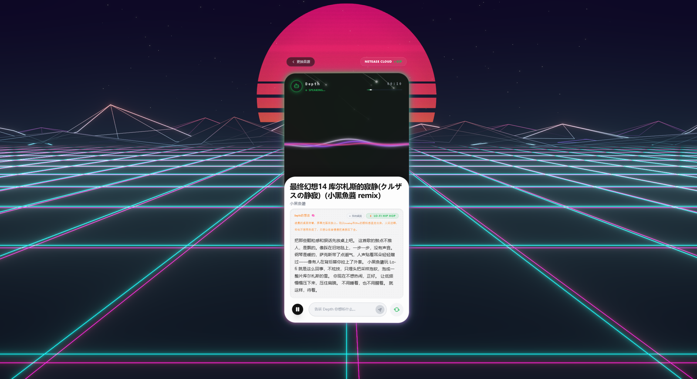

# Vibe Audio

> 一个会观察你、会说话、会自己放歌的桌面 AI 电台。

**Vibe Audio** 是一款基于 Electron + React 构建的桌面 AI 电台应用。它不像传统音乐播放器那样需要你手动选歌——你只需要打开它、做自己的事，AI DJ **Depth** 会通过感知你的电脑使用状态（前台窗口、应用、时间），自动挑选符合当下氛围的音乐，并用温暖的语音（小米 Mimo TTS，茉莉声线）和你聊天串场。



<sub>实际运行截图 —— Depth 正在播放网易云音乐；蒸汽波背景由 Three.js 实时渲染。</sub>

---

## ✨ 核心特性

| 特性 | 说明 |
|------|------|
| 🧠 AI 自动选歌 | DeepSeek 驱动，根据你在做什么、什么心情推荐合适的音乐 |
| 🎙️ AI 语音串场 | 每首歌之间 Depth 会像真人 DJ 一样说话 |
| 👀 环境感知 | 每 15 秒扫描一次前台窗口，了解你在写代码、打游戏还是摸鱼 |
| 🔄 三段式播放循环 | 洞察 → 联想 → 闲聊，三个 Phase 循环，不单调 |
| 🎚️ AB 轨交叉淡入淡出 | 双 Audio 对象无缝切换，无留白 |
| ⏭️ 预加载系统 | 当前歌曲快结束时提前加载下一首，减少等待 |
| 🗣️ 音量闪避 (Ducking) | DJ 说话时背景音乐自动降到 30%，说完恢复 |
| 🎹 频谱可视化 | 3 弦 × 4 层 SVG 物理堆叠可视化 + 独立辉光滤镜 |
| 🌅 蒸汽波背景 | Three.js 实时渲染的复古日落 + 粉色网格 + 雾化氛围 |
| 💬 聊天模式 | 可打字和 Depth 聊天，AI 会判断你是想聊天还是想换歌 |
| 🔁 Roll 换歌 | 一键重置循环，重新扫描你的状态选歌 |
| 🎵 网易云音源 | 扫码登录网易云，接入 VIP 音质 |

---

## 🛠️ 技术栈

| 层面 | 技术 |
|------|------|
| 框架 | Electron + electron-vite |
| 渲染 | React 18 + Tailwind CSS |
| 3D 背景 | Three.js + @react-three/fiber + @react-three/drei + @react-three/postprocessing |
| AI | DeepSeek API |
| TTS | 小米 Mimo API（茉莉声线） |
| 音源 | NeteaseCloudMusicApi（本地代理 port 3001） |
| 系统感知 | active-win |
| 构建 | electron-builder |

---

## 🖱️ 第一次启动(小白版,照做就行)

> 不用懂编程,全程只有两个命令。已经熟的直接跳到下面的[技术版快速开始](#-快速开始)。

### 第 0 步:装 Node.js

去 [nodejs.org/zh-cn](https://nodejs.org/zh-cn) 下载 **LTS 版**,双击一路「下一步」。
装完**把所有终端窗口关掉再重新打开**(否则认不到新装的命令)。

验证一下,应该打印出版本号(如 `v22.x.x`):

```bash
node -v
```

### 第 1 步:在项目文件夹里打开终端

**Windows**

1. 打开「文件资源管理器」,进到本项目的文件夹(有 `package.json` 的那一层)
2. **点最上面的地址栏**,把路径全选删掉
3. 输入 `powershell` 回车 → 会弹出一个**已经定位到该文件夹**的终端

**macOS**

在「访达」里对项目文件夹右键 →「服务」→「新建位于文件夹位置的终端窗口」。
(或打开「终端」,输入 `cd ` 之后把文件夹拖进终端窗口再回车)

### 第 2 步:装依赖(只需第一次)

```bash
npm install
```

等几分钟,刷一堆字是正常的。回到 `PS C:\Users\...>` 之类的提示符就是装好了。

### 第 3 步:启动

```bash
npm run dev
```

等 10~30 秒,窗口会自己弹出来。

- **关闭**:直接关窗口,或回到终端按 `Ctrl + C`
- **下次再开**:重复「第 1 步 + `npm run dev`」即可,不用再 `npm install`

### 第 4 步:填两个密钥

在应用内的设置里填:

| 填什么 | 去哪拿 | 用途 |
|---|---|---|
| **DeepSeek API Key** | [platform.deepseek.com](https://platform.deepseek.com) | 选歌决策 + DJ 台词 |
| **小米 Mimo API Key** | 小米开放平台 | 语音合成(茉莉声线) |

不填也能打开界面,但**不会选歌、也不会说话**。密钥只存在你本机(`localStorage`),不会上传。

### 卡住了?

| 现象 | 原因与解决 |
|---|---|
| `node` / `npm` 不是内部或外部命令 | Node 没装好,或装完没有重开终端 |
| `无法加载文件 …npm.ps1,因为在此系统上禁止运行脚本` | 先执行一次 `Set-ExecutionPolicy -Scope Process -ExecutionPolicy Bypass` |
| `npm install` 卡在 electron 下载 | 国内网络,按下面的镜像设置后重装 |
| 启动时报 Node 版本过低 | 本项目基于 Vite 7,需要 **Node ≥ 20.19**(推荐 22 LTS) |

国内网络加速(可选):

```bash
npm config set electron_mirror https://npmmirror.com/mirrors/electron/
npm config set electron_builder_binaries_mirror https://npmmirror.com/mirrors/electron-builder-binaries/
npm install
```

### 想要一个双击就能用的图标?

```bash
npm run build:win    # Windows
npm run build:mac    # macOS
```

打包产物在 `dist/` 里:

- Windows:`vibe-audio-1.0.0-setup.exe`(安装版)或 `vibe-audio-1.0.0-portable.exe`(免安装,双击即用)
- macOS:`vibe-audio-1.0.0.dmg`

---

## 🚀 快速开始

### 环境要求

- Node.js 20+（推荐 22 LTS）
- npm

### 安装

```bash
git clone https://github.com/God-Lings/Vibe-Audio.git
cd Vibe-Audio
npm install
```

### 开发模式

```bash
npm run dev
```

> 网易云本地 API 代理会在启动时自动拉起（port 3001），无需手动配置。

### 打包

```bash
npm run build:win    # Windows
npm run build:mac    # macOS
npm run build:linux  # Linux
```

---

## ⚙️ 配置

首次启动后在应用内填写：

| 配置项 | 说明 |
|--------|------|
| DeepSeek API Key | AI 决策与台词生成 |
| Mimo API Key | 小米开放平台语音合成（TTS） |
| 网易云登录 | 扫码登录（Cookie 合并模式持久化） |

所有密钥统一存储在本地 `localStorage`，不会上传。

---

## 🎧 工作原理

```
前台窗口感知 (每15s)
      │
      ▼
buildContext() 统一组装上下文
      │
      ▼
Phase 0 深度洞察 ──→ Phase 1 音乐联想 ──→ Phase 2 世界连接 ──→ 循环
      │                                        │
      ▼                                        ▼
搜索歌曲（精确点歌/歌单搜索/兜底搜索）     从歌曲引出随机话题闲聊
      │
      ▼
播放歌曲 + DJ 语音串场（双阶段推流）
```

- **搜索策略**：精确点歌 → 歌单搜索（随机 offset）→ 兜底搜索，全程跳过已播歌曲（最近 15 首持久化去重）
- **双阶段推流**：先返回歌曲立即播放，台词 + TTS 异步生成后推送到前端
- **意图识别**：用户消息自动区分「聊天」还是「换歌」

---

## 📁 目录结构

```
vibe-audio/
├── src/
│   ├── main/
│   │   ├── index.js              # 主进程入口：IPC、窗口、环境感知、登录、日志转发
│   │   ├── ai.js                 # AI 大脑：三段式循环、上下文拼装、搜索策略、TTS
│   │   ├── audioSourceProxy.js   # VIP 歌曲检测
│   │   └── neteaseLogin.js       # 网易云扫码登录
│   ├── preload/
│   │   └── index.js              # contextBridge
│   └── renderer/
│       └── src/
│           ├── App.jsx           # 播放引擎 + 音量控制 + 可视化 + UI
│           └── components/       # TypewriterText / TiltCard / ScrambleText / RetroFutureBackground
├── build/                        # electron-builder 图标资源
├── docs/                         # 详细软件说明文档
└── package.json
```

---

## 🗺️ Roadmap

- [ ] **Spotify 集成**：Web Playback SDK + PKCE 认证，支持用户歌单模式（DJ 点评 + 闲聊）
- [ ] 更多音源接入

---

## 📄 License

本项目仅供学习交流使用。

---

*更多技术细节见 [docs/VIBE_AUDIO_软件说明.md](docs/VIBE_AUDIO_软件说明.md)*
